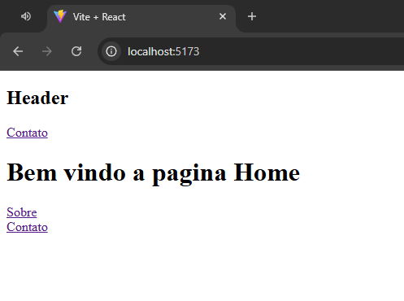

# Projeto React + Vite - Casos de Estudo

Este projeto demonstra conceitos fundamentais de React com React Router, utilizando Vite para desenvolvimento rápido.



## Estrutura de Pastas

- **src/pages/Home**: Página inicial do projeto.
- **src/pages/Sobre**: Página "Sobre".
- **src/pages/Contato**: Página de contato, com navegação para Home e Sobre.
- **src/pages/Produto**: Exibe detalhes de um produto com base no parâmetro da URL.
- **src/pages/Erro**: Página de erro para rotas não encontradas.
- **src/components/Header**: Componente de cabeçalho reutilizável.
- **src/routes.jsx**: Configuração das rotas usando `react-router-dom`.

## Casos de Estudo

### 1. Navegação entre páginas

Utiliza o [`Link`](https://reactrouter.com/en/main/components/link) do React Router para navegação sem recarregar a página, como visto em [`src/pages/Contato/index.jsx`](src/pages/Contato/index.jsx).

### 2. Parâmetros de rota

A página [`src/pages/Produto/index.jsx`](src/pages/Produto/index.jsx) utiliza o hook [`useParams`](https://reactrouter.com/en/main/hooks/use-params) para acessar parâmetros dinâmicos da URL.

### 3. Tratamento de rotas não encontradas

A página [`src/pages/Erro/index.jsx`](src/pages/Erro/index.jsx) é exibida quando o usuário acessa uma rota inexistente, sugerindo caminhos válidos.

### 4. Organização de componentes

O projeto separa componentes reutilizáveis (como Header) e páginas, facilitando a manutenção e escalabilidade.

## Como rodar o projeto

1. Clone o repositório:
   ```sh
   git clone https://github.com/marcionavarro/udemypro-nextjs-do-zero-ao-avancado-na-pratica-2025.git
2. Acesse a pasta aula-2:
   ```sh
   cd aula-2
3. Instale as dependências:
   ```sh
   npm install
4. Inicie o projeto:
   ```sh
   npm run dev
5. Acesse http://localhost:5173 no navegador.
