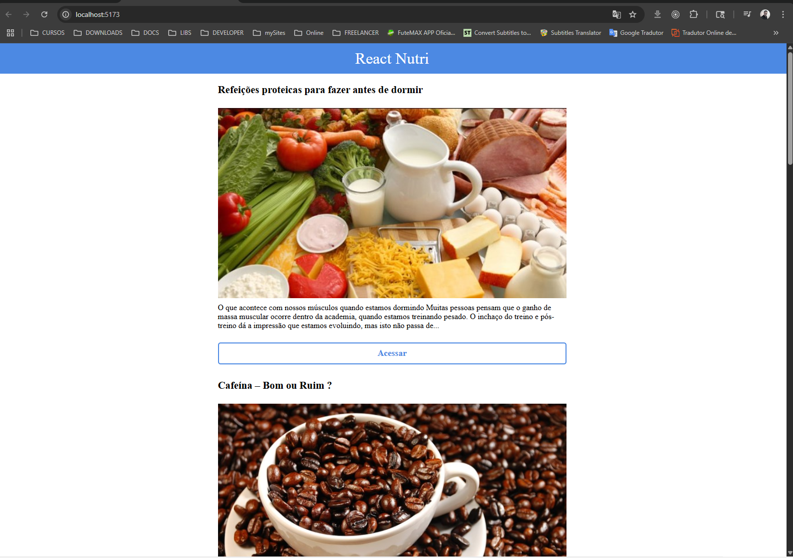

# React Nutri

Este projeto é uma aplicação React simples que consome uma API de receitas e exibe uma lista de posts de nutrição. O objetivo é demonstrar o uso de hooks (`useState` e `useEffect`), consumo de API com `fetch` e renderização de listas no React.



## Funcionalidades

- Consome a API pública [Sujeito Programador - RN API](https://sujeitoprogramador.com/rn-api/?api=posts)
- Exibe uma lista de posts com título, imagem de capa, subtítulo e um botão de acesso
- Utiliza React Hooks para gerenciamento de estado e efeitos colaterais

## Como rodar o projeto

1. Clone o repositório:
   ```sh
   git clone https://github.com/marcionavarro/udemypro-nextjs-do-zero-ao-avancado-na-pratica-2025.git
2. Acesse a pasta aula:
   ```sh
   cd aula
3. Instale as dependências:
   ```sh
   npm install
4. Inicie o projeto:
   ```sh
   npm run dev
5. Acesse http://localhost:5173 no navegador.

## Estrutura principal
- src/App.jsx: Componente principal responsável por buscar e exibir os posts.
- src/style.css: Estilos da aplicação.
