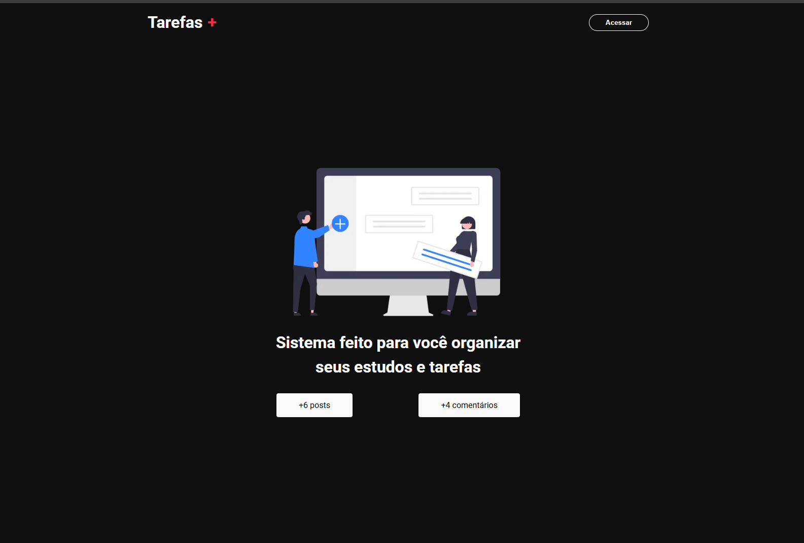
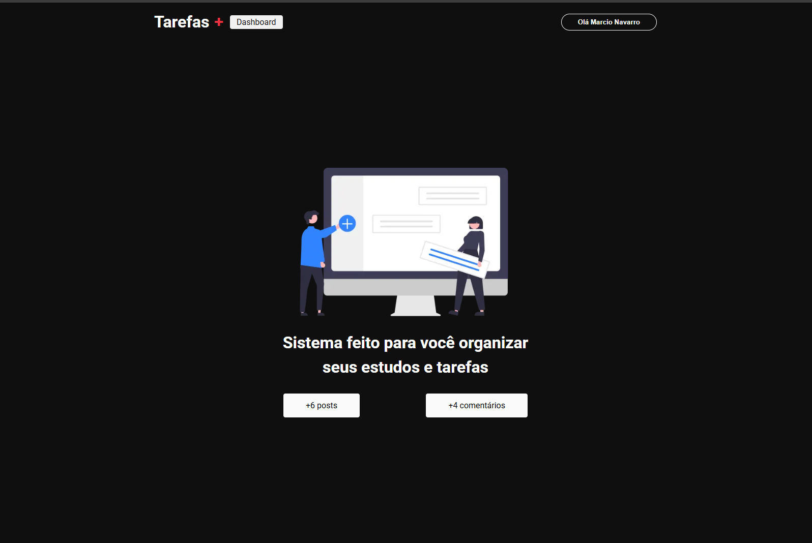
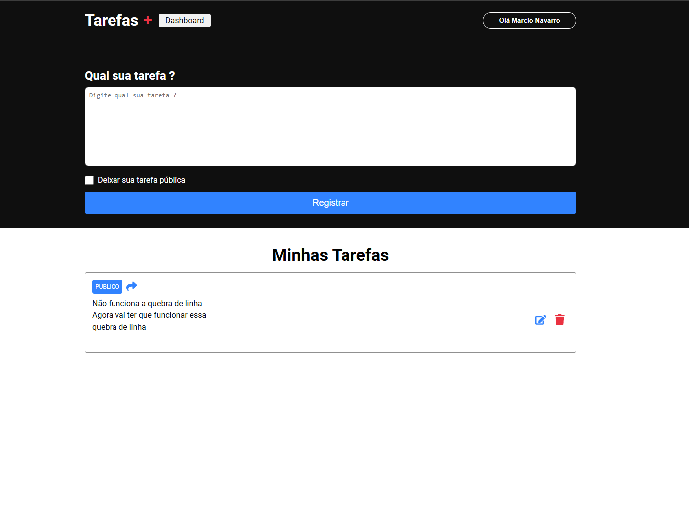
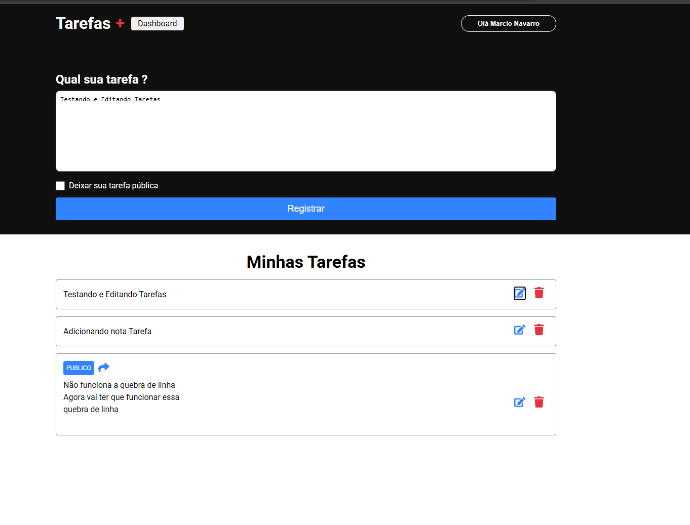

# 📝 Tarefas+

Projeto desenvolvido com [Next.js](https://nextjs.org) (Pages Router), focado em organização de tarefas, autenticação e comentários.

<table style="width: 100%">
  <tr>
    <td></td>
    <td></td>
  </tr>
  <tr>
    <td></td>
    <td></td>
  </tr>
</table>

## ✨ Principais Funcionalidades

- 🔐 **Autenticação:** Utiliza `next-auth` com login via Google.
- 🗂️ **Cadastro de Tarefas:** Usuários autenticados podem cadastrar tarefas, públicas ou privadas.
- 📊 **Dashboard:** Área exclusiva para o usuário gerenciar suas tarefas.
- 💬 **Comentários:** Usuários podem comentar em tarefas públicas.
- 🔢 **Contagem de Posts e Comentários:** Exibida na página inicial.
- 💾 **Persistência:** Dados armazenados no Firebase Firestore.

## 📁 Estrutura de Pastas

- `src/components/` — Componentes reutilizáveis, como `Header`.
- `src/pages/` — Páginas principais do app.
- `src/services/` — Conexão com Firebase e outros serviços.
- `src/styles/` — Estilos globais e módulos CSS.

## 🔑 Fluxo de Autenticação

- O componente `Header` utiliza o hook `useSession` para verificar o status do usuário.
- Usuário autenticado vê o botão de logout e acesso ao dashboard.
- Usuário não autenticado vê o botão de login.

## 📝 Cadastro e Listagem de Tarefas

- Usuário logado pode cadastrar tarefas via formulário no dashboard.
- Tarefas podem ser públicas (visíveis para todos) ou privadas.
- Tarefas públicas podem ser acessadas por qualquer usuário e recebem comentários.

## 💬 Comentários

- Página de tarefa permite que usuários autenticados comentem.
- Comentários são listados e podem ser editados/deletados pelo autor.

## 🛠️ Tecnologias Utilizadas

- ⚡ **Next.js** (Pages Router)
- ⚛️ **React**
- 🔐 **Next Auth**
- 🔥 **Firebase Firestore**
- 🎨 **CSS Modules**

## 🔧 Variáveis de Ambiente (.env)

### NextAuth
NEXTAUTH_URL=  
NEXTAUTH_SECRET=

### Google Auth
GOOGLE_CLIENT_ID=  
GOOGLE_CLIENT_SECRET=

### Firebase
FIREBASE_API_KEY=  
FIREBASE_AUTH_DOMAIN=  
FIREBASE_PROJECT_ID=  
FIREBASE_STORAGE_BUCKET=  
FIREBASE_MESSAGING_SENDER_ID=  
FIREBASE_APP_ID=  

## ▶️ Como rodar o projeto com pnpm
1. Clone o repositório:
   ```sh
   git clone https://github.com/marcionavarro/udemypro-nextjs-do-zero-ao-avancado-na-pratica-2025.git
2. Acesse a pasta tarefas:
   ```sh
   cd tarefas
3. Instale as dependências:
   ```sh
   pnpm install ou npm install
   ```
4. Inicie o servidor de desenvolvimento:
   ```sh
   pnpm dev ou npm run dev
   ```
3. Acesse [http://localhost:3000](http://localhost:3000)

---
